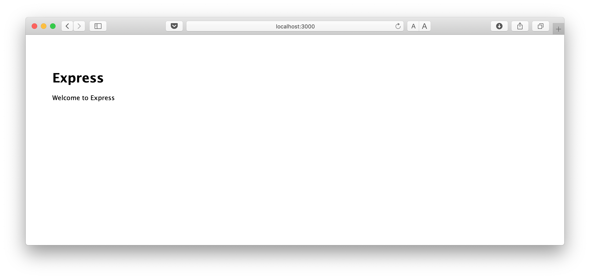
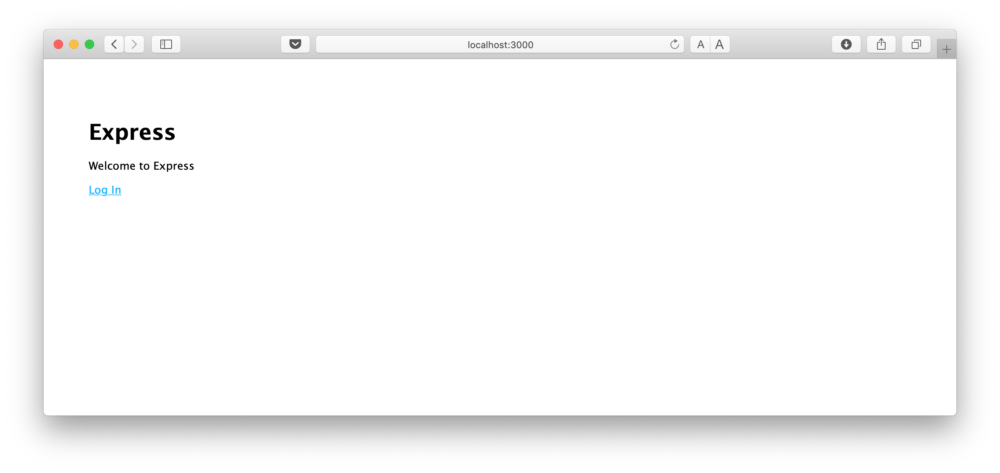
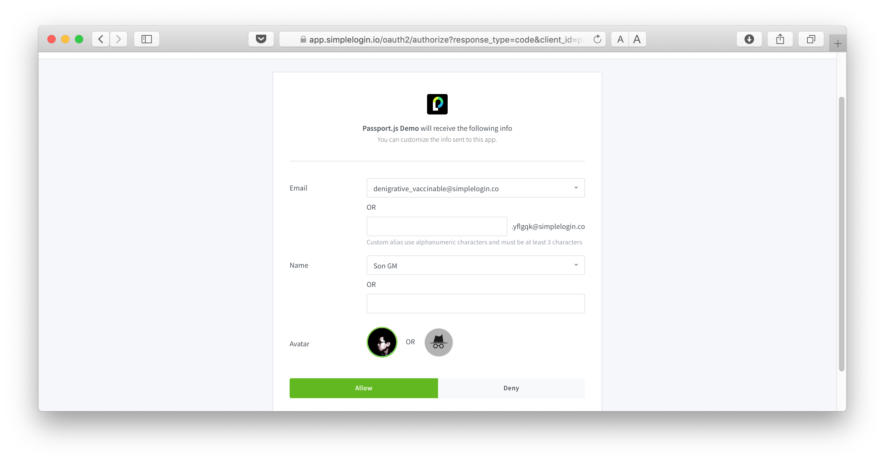
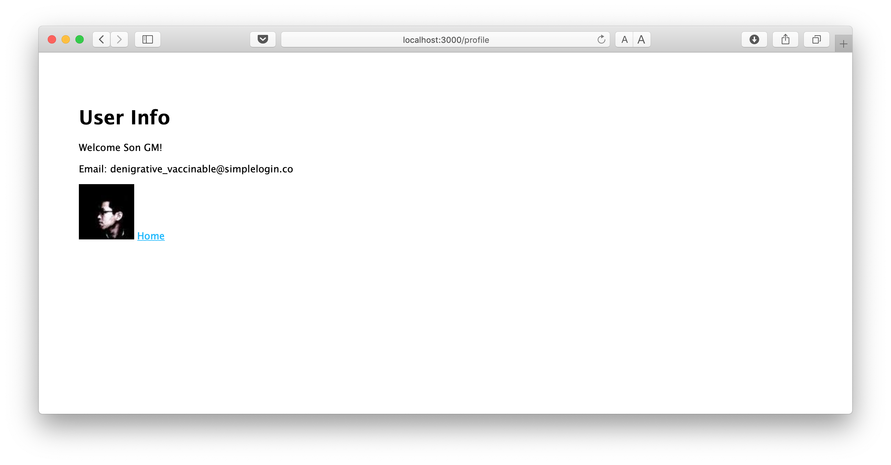

# Step 1: Bootstrap

Create a folder for the project 

```bash
mkdir passportjs-example 
cd passportjs-example 
```

Install express generator:

> npm install express-generator -g

Generate the project

> express -e .

Install all dependencies:

> npm i

Run the project

> npm start

Open http://localhost:3000, you should see this empty page



# Step 2: Bootstrap OpenID

Install `dotenv`

> npm install dotenv --save

Load `dotenv`, add the following lines on top of `app.js`:

```js
require('dotenv').config()
```

Create the `.env` file based on the `.env.example` one:

> cp .env.example .env

Get the OAuth-Client-Id and OAuth-Client-Secret from your SimpleLogin app and make sure to fill up the corresponding values in `.env`

Install `passport passport-openidconnect express-session`

> npm install passport@0.4.0 passport-openidconnect@0.0.2 express-session@1.15.6 --save

Add the following lines to `app.js` just below `var logger = require('morgan');` to import passport:

```js
var session = require('express-session');
var passport = require('passport');
var OidcStrategy = require('passport-openidconnect').Strategy;
```

At this step, `npm start` should still work and http://localhost:3000 is still this empty page.


# Step 3: Config passport.js

Just below `app.use(express.static(path.join(__dirname, 'public')));`, add the following line to init passport.js.

The first part is to config `session` for passport.js, please make sure to replace `very-secret` if you decide to deploy the code on production 😎. We also need to tell passport.js how to serialize/deserialize user from/to session.

The second part is to setup passport.js with OIDC endpoints and with the OAuth credential parsed from the `.env` file setup in previous step. 

```js
// passportjs use session to store user info
app.use(session({
  secret: 'very-secret',
  resave: false,
  saveUninitialized: true
}));

app.use(passport.initialize());
app.use(passport.session());

passport.serializeUser((user, next) => {
  next(null, user);
});

passport.deserializeUser((obj, next) => {
  next(null, obj);
});

// config different OIDC endpoints
passport.use('oidc', new OidcStrategy({
  issuer: 'https://app.simplelogin.io',
  authorizationURL: 'https://app.simplelogin.io/oauth2/authorize',
  tokenURL: 'https://app.simplelogin.io/oauth2/token',
  userInfoURL: 'https://app.simplelogin.io/oauth2/userinfo',
  clientID: process.env.CLIENT_ID, // OAuth config from env thanks to dotenv
  clientSecret: process.env.CLIENT_SECRET,
  callbackURL: 'http://localhost:3000/authorization-code/callback',
  scope: 'openid profile'
}, (issuer, sub, profile, accessToken, refreshToken, done) => {
  return done(null, profile);
}));

```

# Step 4: OpenID Connect Flow

The social login starts by redirecting user to the Social Login Provider authorization page. Once user approves sharing their data with the app, user gets redirected back to the `callback` endpoint with a `code` in url that we'll use to exchange for `access token`. This `access token` will then allow us to get user information.

We would need the following routes:

- `/login` for redirecting user to the authorization page
- `/authorization-code/callback` to received the `code` when user is redirected back from authorization page.
- (Optional) `/profile` page to show the obtained user information.

Let's start by adding a "Login" button onto the home page: in `views/index.ejs`, add this line just before `</body>`

```
<a href="/login">Log In</a>
```

Create a profile page to show user information. In the same terminal, create a `profile.ejs` file by `touch views/profile.ejs` and add this content to this file:

```html
<!DOCTYPE html>
<html>
  <head>
    <title><%= title %></title>
    <link rel='stylesheet' href='/stylesheets/style.css' />
  </head>
  <body>
    <h1><%= title %></h1>
    <p>Welcome <%= user.name %>!</p>    
    <p>Email: <%= user.email %></p>
    ">
    <a href="/">Home</a>
  </body>
</html>
```

Now let's add the 3 endpoints `/login`, `/authorization-code/callback`, `/profile` just below the code we added in the previous step:

```js
// redirect user to authorization page
app.use('/login', passport.authenticate('oidc'));

// user is redirected back with the *code*
app.use('/authorization-code/callback',
  passport.authenticate('oidc', {
    failureRedirect: '/error'
  }),
  (req, res) => {
    // redirect user to /profile so they can see their information
    res.redirect('/profile');
  }
);

// show user info
app.use('/profile', (req, res) => {
  console.log("user:", req);
  res.render('profile', {
    title: 'User Info',
    user: req.user._json
  });
});
```

Now re-run `npm start`, http://localhost:3000 should show this login button and clicking on the login button should open the authorization page.



Authorization page



User gets redirected back to our app:



Congratulations, you just add social login to a Node.js app using passport.js with OpenID Connect strategy!


